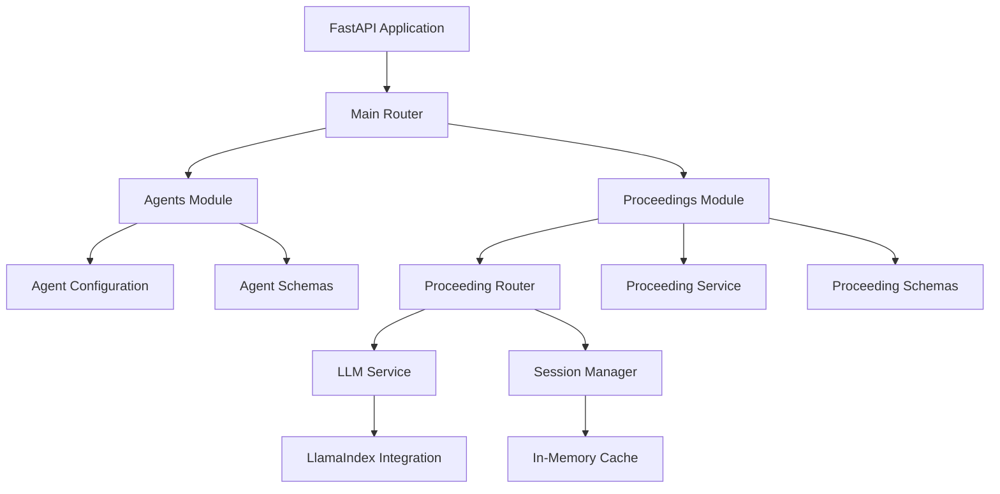

# Bernardo API - Legal Proceeding Analysis Chatbot

## Project Overview

Bernardo API is a FastAPI-based application that provides legal proceeding analysis using AI agents. The system allows users to interact with legal documents through specialized agents that can summarize proceedings and answer questions about them. The application uses LlamaIndex for LLM integration and provides a RESTful API for accessing its functionality.

The API is designed to scrape legal proceeding data from official sources, process it, and make it available for interaction through different specialized agents. It features session management for efficient handling of document data and supports multiple agent types for different legal analysis tasks.

## Architecture

The application follows a modular architecture with the following key components:



### Core Components

1. **Main Application**: The entry point that initializes the FastAPI app and registers routers
2. **Agents Module**: Manages different AI agents with specialized capabilities
3. **Proceedings Module**: Handles legal proceeding data processing and interaction
4. **Core Module**: Provides shared services like LLM integration and session management

### Data Flow

1. User requests are received through API endpoints
2. The proceedings module scrapes or retrieves legal document data
3. Session management caches document data for efficient reuse
4. Agents process the data using LLM services
5. Responses are returned to the user

## API Endpoints

### Health Check

#### GET `/health`
Health check endpoint to verify the application is running.

**Response:**
```json
{
  "status": "healthy",
  "message": "Application is running successfully"
}
```

### Agents

#### GET `/agents/`
Get list of available agents.

**Response:**
```json
[
  {
    "id": "summary_agent",
    "name": "Summary Agent",
    "description": "Agent responsible for summarizing legal proceedings and documents"
  },
  {
    "id": "chat_agent",
    "name": "Chat Agent",
    "description": "Agent for interactive legal consultation and question answering"
  }
]
```

### Proceedings

#### POST `/proceeding/{jurisdiction_id}/{proceeding_number}/chat/{agent_id}`
Chat with a proceeding using a specific agent in a single session.

**Path Parameters:**
- `jurisdiction_id` (string): The jurisdiction identifier
- `proceeding_number` (string): The proceeding number
- `agent_id` (string): The agent to use for the chat

**Request Body:**
```json
{
  "message": "What is this proceeding about?"
}
```

**Response:**
```json
{
  "response": "Generated response based on the proceeding data...",
  "agent_id": "chat_agent"
}
```

#### POST `/proceeding/{jurisdiction_id}/{proceeding_number}/summary/{agent_id}`
Generate a summary of a proceeding using a specific agent.

**Path Parameters:**
- `jurisdiction_id` (string): The jurisdiction identifier
- `proceeding_number` (string): The proceeding number
- `agent_id` (string): The agent to use for summarization (must be "summary_agent")

**Response:**
```json
{
  "summary": "Generated summary of the proceeding...",
  "agent_id": "summary_agent"
}
```

## Modules

### Agents

The agents module manages different AI agents with specialized capabilities for legal analysis:

- **Summary Agent**: Specialized in summarizing legal proceedings and documents
- **Chat Agent**: Designed for interactive legal consultation and question answering

Each agent has its own configuration including:
- System prompts that guide the LLM's behavior
- LLM model specifications
- Descriptive metadata

### Core

The core module provides shared services used across the application:

- **LLM Service**: Interface for interacting with LLMs using LlamaIndex
- **Session Manager**: In-memory caching system for proceeding data
- **Exceptions**: Custom exception classes for error handling

### Proceedings

The proceedings module handles legal proceeding data processing:

- **Service**: Scrapes and processes legal proceeding data
- **Router**: Exposes endpoints for proceeding interaction
- **Schemas**: Defines data models for requests and responses

## Setup Instructions

### Prerequisites

- Python 3.8+
- [uv](https://docs.astral.sh/uv/) for Python package and environment management
- [Docker](https://www.docker.com/) (optional, for containerized deployment)

### Installation

1. Navigate to the backend directory:
   ```bash
   cd backend
   ```

2. Install dependencies using uv:
   ```bash
   uv sync
   ```

3. Activate the virtual environment:
   ```bash
   source .venv/bin/activate  # On Windows: .venv\Scripts\activate
   ```

### Environment Configuration

1. Create a `.env` file in the backend directory based on the provided template:
   ```bash
   cp .env.example .env  # If .env.example exists
   ```
   
2. Update the `.env` file with your configuration values, particularly the API key:
   ```env
   API_KEY=your_actual_api_key_here
   ```

### Running the Application

#### Development Mode

1. Start the application with auto-reload for development:
   ```bash
   fastapi run --reload src/main.py
   ```

2. The API will be available at `http://localhost:8000`

#### Production Mode

1. Start the application:
   ```bash
   fastapi run src/main.py
   ```

2. The API will be available at `http://localhost:8000`

### Docker Deployment

1. Build the Docker image:
   ```bash
   docker build -t bernardo-api .
   ```

2. Run the container:
   ```bash
   docker run -p 8000:8000 bernardo-api
   ```

## Dependencies

The application requires the following Python packages:

- `fastapi>=0.68.0`: Web framework for building APIs
- `uvicorn>=0.15.0`: ASGI server for running FastAPI applications
- `pydantic>=1.8.0`: Data validation and settings management
- `llama-index>=0.8.0`: Framework for building LLM applications
- `python-dotenv>=0.19.0`: Loading environment variables from .env files

Additional dependencies for the full application:
- `SQLModel`: Database ORM
- `psycopg2`: PostgreSQL adapter
- `python-multipart`: For file uploads
- `email-validator`: For email validation
- `passlib`: For password hashing
- `tenacity`: For retry utilities
- `pyjwt`: For JWT token handling
- `python-jose`: For JWT cryptographic operations
- `httpx`: For HTTP requests
- `sentry-sdk`: For error tracking
- `alembic`: For database migrations
- `typer`: For CLI commands

## Environment Variables

The application uses the following environment variables:

```env
# LLM Service API Key (placeholder value)
API_KEY=your_api_key_here

# Other configuration variables can be added here as needed
```

For the full application, additional environment variables are required:

```env
# Domain configuration
DOMAIN=localhost
FRONTEND_HOST=http://localhost:5173
ENVIRONMENT=local

# Project settings
PROJECT_NAME=Bernardo
STACK_NAME=bernardoapi-project

# Backend configuration
BACKEND_CORS_ORIGINS="http://localhost,http://localhost:5173,https://localhost,https://localhost:5173,http://localhost.tiangolo.com"
SECRET_KEY=changethis
FIRST_SUPERUSER=admin@example.com
FIRST_SUPERUSER_PASSWORD=admin123

# Email settings
SMTP_HOST=
SMTP_USER=
SMTP_PASSWORD=
EMAILS_FROM_EMAIL=info@example.com
SMTP_TLS=True
SMTP_SSL=False
SMTP_PORT=587

# Database settings
POSTGRES_SERVER=localhost
POSTGRES_PORT=5432
POSTGRES_DB=app
POSTGRES_USER=postgres
POSTGRES_PASSWORD=Coradir2017!

# Error tracking
SENTRY_DSN=
```

## Example Usage

### Get Available Agents

```bash
curl -X GET http://localhost:8000/agents/
```

**Response:**
```json
[
  {
    "id": "summary_agent",
    "name": "Summary Agent",
    "description": "Agent responsible for summarizing legal proceedings and documents"
  },
  {
    "id": "chat_agent",
    "name": "Chat Agent",
    "description": "Agent for interactive legal consultation and question answering"
  }
]
```

### Chat with a Proceeding

```bash
curl -X POST http://localhost:8000/proceeding/US/12345/chat/chat_agent \
  -H "Content-Type: application/json" \
  -d '{"message": "What is the main issue in this proceeding?"}'
```

**Response:**
```json
{
  "response": "Generated response based on:\nSystem Prompt: You are a legal assistant helping lawyers and legal professionals with their queries. Provide accurate, well-reasoned responses based on legal principles and precedents. Be concise but thorough in your explanations.\nUser Query: What is the main issue in this proceeding?\nDocument Text: Proceeding Data for Jurisdiction: US, Proceeding Number: 12345\n\nThis is a simulated legal proceeding document for demonstration purposes. In a real implementation, this data would be scraped from official court websites or extracted from PDF documents.\n\nCASE DETAILS:\n- Case Title: Sample Legal Proceeding 12345\n- Jurisdiction: US\n- Filed Date: January 1, 2024\n- Court: Superior Court of US\n- Judge: Hon. Jane Doe\n- Parties: Plaintiff v. Defendant\n\nSUMMARY OF PROCEEDINGS:\nThis is an example of legal proceeding text that would be processed by the system. The actual implementation would involve web scraping from court websites or PDF parsing, but for demonstration purposes, we're using this placeholder text.\n\nKEY POINTS:\n1. This is simulated data\n2. Real implementation would involve actual scraping\n3. The data would be processed and formatted for LLM consumption\n4. This text represents what might be found in a legal proceeding document\n\nThis placeholder will be replaced with actual scraping logic in a production environment.... (truncated)\nModel: gemini-pro\n\nThis is a placeholder response from the LLM service.",
  "agent_id": "chat_agent"
}
```

### Generate a Proceeding Summary

```bash
curl -X POST http://localhost:8000/proceeding/US/12345/summary/summary_agent
```

**Response:**
```json
{
  "summary": "Generated response based on:\nSystem Prompt: You are a legal expert specialized in summarizing court proceedings and legal documents. Provide concise, accurate summaries that capture the key points, decisions, and implications of legal matters.\nUser Query: Please provide a summary of this legal proceeding.\nDocument Text: Proceeding Data for Jurisdiction: US, Proceeding Number: 12345\n\nThis is a simulated legal proceeding document for demonstration purposes. In a real implementation, this data would be scraped from official court websites or extracted from PDF documents.\n\nCASE DETAILS:\n- Case Title: Sample Legal Proceeding 12345\n- Jurisdiction: US\n- Filed Date: January 1, 2024\n- Court: Superior Court of US\n- Judge: Hon. Jane Doe\n- Parties: Plaintiff v. Defendant\n\nSUMMARY OF PROCEEDINGS:\nThis is an example of legal proceeding text that would be processed by the system. The actual implementation would involve web scraping from court websites or PDF parsing, but for demonstration purposes, we're using this placeholder text.\n\nKEY POINTS:\n1. This is simulated data\n2. Real implementation would involve actual scraping\n3. The data would be processed and formatted for LLM consumption\n4. This text represents what might be found in a legal proceeding document\n\nThis placeholder will be replaced with actual scraping logic in a production environment.... (truncated)\nModel: gemini-pro\n\nThis is a placeholder response from the LLM service.",
  "agent_id": "summary_agent"
}
